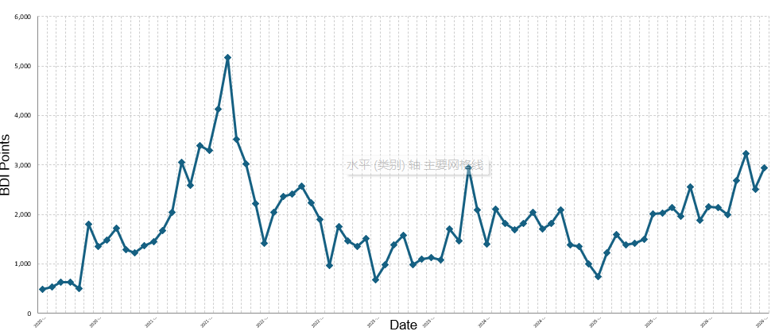
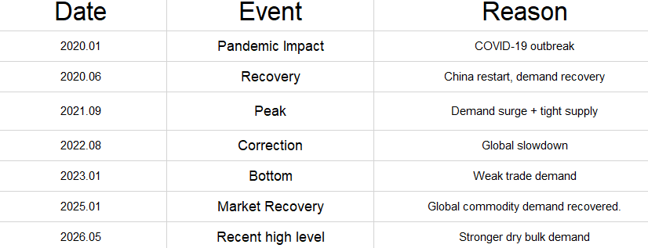
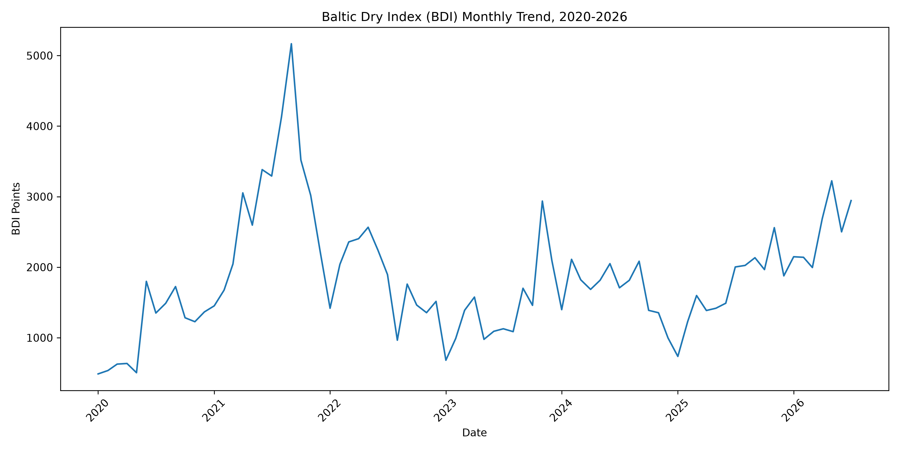

# Dry Bulk Shipping Market Analysis Based on BDI (2020-2026)


A portfolio project that analyzes monthly Baltic Dry Index movements and
connects them with dry-bulk cargo demand, vessel supply, port congestion,
economic cycles and external shocks.

## Project highlights

- 79 monthly observations from January 2020 to July 2026
- Excel workbook with raw data, trend analysis, key events and market insights
- Reproducible Python cleaning, metrics, annual summary and visualization
- Unit tests running on Python 3.11 and 3.12 through GitHub Actions
- PDF market report and presentation-ready charts
- Transparent field definitions in [DATA_DICTIONARY.md](DATA_DICTIONARY.md)

## Repository structure

```text
├── data/       # raw or Python-generated analytical outputs
├── excel/      # source CSV and Excel market-analysis workbook
├── images/     # Excel and Python visualizations
├── python/     # reproducible analysis and dependencies
├── report/     # formal BDI market report
├── tests/      # automated data and metric tests
└── README.md
```

## Data scope

- **Index:** Baltic Dry Index (BDI)
- **Frequency:** monthly
- **Period:** January 2020 to July 2026
- **Historical data source:** Investing.com export used for educational analysis

The dataset includes Date, Price, Open, High, Low, Volume and Change fields.
See the data dictionary for calculation definitions and limitations.

## Run the analysis

From the repository root:

```bash
python -m pip install -r python/requirements.txt
python python/bdi_analysis.py
```

The script validates and cleans the source CSV, then generates:

- `data/BDI_Analysis_Output.csv`
- `data/BDI_Annual_Summary.csv`
- `images/bdi_trend_python.png`

## Run the tests

```bash
python -m pip install -r python/requirements-dev.txt
python -m pytest -q
```

## Analysis framework

The project interprets BDI movements through:

1. **Cargo demand** — iron ore, coal, grain and other dry-bulk trades
2. **Vessel supply** — fleet growth, deliveries and slow capacity adjustment
3. **Effective capacity** — congestion, turnaround time and vessel availability
4. **Economic cycle** — industrial output, commodity demand and financial conditions
5. **External shocks** — pandemics, energy disruptions and geopolitical events

## Key findings

- Dry-bulk freight markets show strong cyclical behavior.
- The 2021 increase reflected demand recovery, congestion and reduced effective capacity.
- The following correction combined weaker demand with improved vessel availability.
- Because vessel supply adjusts slowly, short-term demand and efficiency changes can
  produce large freight-rate movements.
- BDI is a broad dry-bulk indicator and should not be treated as a container-rate index
  or a direct measure of one company's earnings.

## Visualizations

### BDI trend analysis



### Key-event analysis



### Python-generated trend



## Tools

Microsoft Excel, Python, pandas, matplotlib, pytest and GitHub Actions.

## Disclaimer

This project is for education, portfolio presentation and shipping-market
discussion. It is not investment advice or a causal econometric study.
